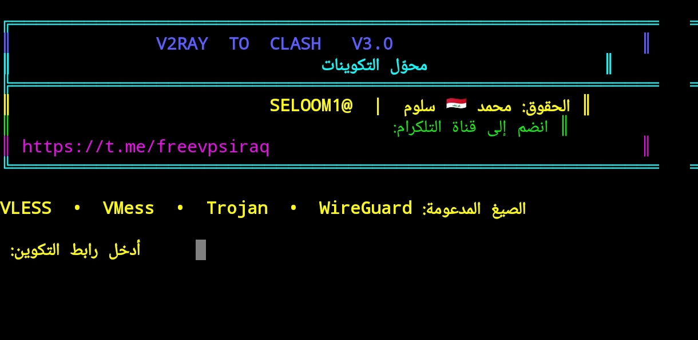

# V2RAY TO CLASH V3.0

<p align="center">
  
</p>

<p align="center">
  محوّل تكوينات <strong>VLESS وVMess وTrojan وWireGuard</strong><br>
  إلى ملفات YAML متوافقة مع Mihomo وClash Meta وBox4Magisk
</p>

<p align="center">
  <a href="https://github.com/boxproxy">BoxProxy</a> ·
  <a href="https://t.me/freevpsiraq">قناة التلكرام</a>
</p>

## الحقوق

**محمد 🇮🇶 سلوم — [@SELOOM1](https://t.me/SELOOM1)**

للانضمام إلى قناة التلكرام:

**[https://t.me/freevpsiraq](https://t.me/freevpsiraq)**

## المزايا

- تحويل روابط `vless://` و`vmess://` و`trojan://`.
- تحويل روابط `wireguard://` إلى قالب Mihomo WireGuard.
- إنشاء ملف YAML ونقله تلقائيًا إلى مجلد Mihomo عند توفر صلاحيات الروت.
- دعم العربية والأسماء المزخرفة والأعلام.
- متوافق مع Mihomo وClash Meta وBox4Magisk.

## التشغيل على Linux أو Termux

تأكد من وجود Python 3، ثم شغّل:

```bash
python3 V2RAY_TO_CLASH_V3.0.py
```

ألصق رابط التكوين عند ظهور الطلب. الصيغ المدعومة:

```text
vless://...
vmess://...
trojan://...
wireguard://...
```

## التشغيل على Android

يحتاج النقل التلقائي إلى صلاحيات root وإلى وجود المسار الذي يستخدمه Box4Magisk. إذا لم يتم النقل تلقائيًا، سيبقى ملف YAML في المجلد الحالي ويمكن نسخه يدويًا إلى مجلد Mihomo.

لا تشغّل تطبيق WireGuard منفصلًا بالتزامن مع بروكسي WireGuard داخل Mihomo.

## تنبيه أمني

لا تنشر روابط VPN أو مفاتيح WireGuard الخاصة داخل GitHub. رابط WireGuard قد يحتوي على `privatekey`، لذلك استخدم روابط تجريبية منزوعة المفاتيح عند كتابة الأمثلة. إذا تم نشر مفتاح خاص بالخطأ، قم بتغييره فورًا.

## المساعدون والمشاريع المرتبطة

- [BoxProxy](https://github.com/boxproxy)

## الترخيص والحقوق

حقوق السكربت محفوظة لـ **محمد 🇮🇶 سلوم — @SELOOM1**.

**TELEGRAM:** [https://t.me/freevpsiraq](https://t.me/freevpsiraq)
